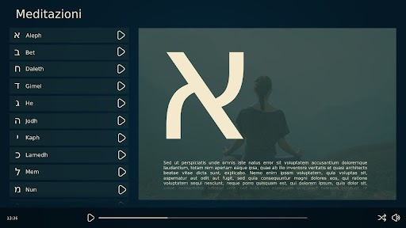

# Meditation

## Alfabeth
## Il sito per la meditazione


 _IF9MYSBzY3VvbGEgYXMgYWx3YXlzIHRyb3ZhIHVuIG1vZG8gcGVyIHNmcnV0dGFyY2lf_
 

## Descrizione 
Sito dove è possibile ricavare uno spazio personale meditando sulle lettere della meditazione

- **Alef**

- **Bet**

- **Chet**

- **Dalet**
  
- **Ghimel**

- **Hei**

- **Kaf**

- **Lamed**
  
- **Nun**

- **Shin**

- **Tet**

- **Vav**

- **Yod**

- **Zain**

## Funzionalità 
Possibilità di ascoltare le varie lettere attraverso player integrati in ogni pagina che contiene a sua volta la lettera

## Utility
- **Palette:** [Qui](https://coolors.co/040303-3a4e48-6a7b76-8b9d83-beb0a7)
- **Icona del sito sulla barra della scheda:** [Qui](https://redketchup.io/favicon-generator)


## Requisiti di sistema
- Un computer che abbia [Google Chrome](https://www.google.it/intl/it/chrome/next-steps.html?statcb=1&installdataindex=empty&defaultbrowser=0&brand=CHBD&ds_kid=43700059034491688&_gl=1*7aa71z*_up*MQ..&gclid=Cj0KCQiA2KitBhCIARIsAPPMEhLc5aW_Uj8n4JUkBPvZFHOxFmUORLaLtzJi05QPU52PUUjxltF9No8aAvp8EALw_wcB&gclsrc=aw.ds#), [Microsoft Edge](https://www.microsoft.com/it-it/edge/download?form=MA13FJ) o [Firefox](https://www.mozilla.org/it/firefox/download/thanks/)

## Download e installazione

 Clonate la repository se volete avere il source code oppure andate a questo [link](https://www.youtube.com/watch?v=dQw4w9WgXcQ&pp=ygUIcmlja3JvbGw%3D) per visitare il sito:

 ```shell
git clone https://github.com/antoniocariaa/Meditation.git
```

> Sito [Meditation](https://youtu.be/dQw4w9WgXcQ?si=xOFnJNM6iuYwexiC) &nbsp;&middot;&nbsp;
